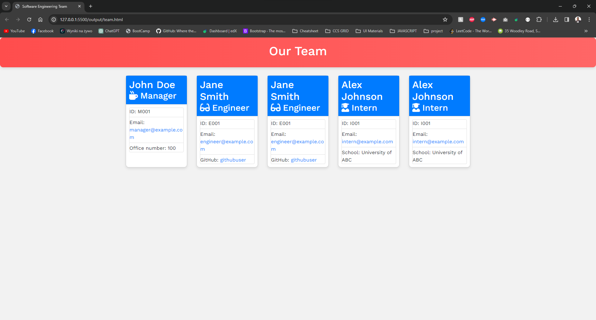

# Team Profile Generator

## Description

The Team Profile Generator is a Node.js command-line application designed to streamline the process of generating a webpage that displays summaries for each member of a software engineering team. This application allows users to input information about team members, including managers, engineers, and interns, and then generates an HTML webpage with their basic info, such as name, email, and GitHub profile. This project aims to facilitate team management by providing quick access to essential details about each team member.

## Table of Contents

- [Description](#description)
- [Installation](#installation)
- [Usage](#usage)
- [Features](#features)
- [Screenshots and Demo](#screenshots-and-demo)
- [License](#license)
- [Acknowledgements](#acknowledgements)
- [Technologies Used](#technologies-used)

## Installation

To install the Team Profile Generator, follow these steps:

1. Clone the repository to your local machine using `git clone https://github.com/MrKatrish/team_profile_generator.git`
2. Navigate to the cloned directory and run `npm install` to install all necessary dependencies.
3. Ensure Node.js is installed on your machine to execute the application.

## Usage

To use the Team Profile Generator:

1. Navigate to the root directory of the project in your terminal.
2. Run the command `node index.js` to initiate the prompts.
3. Enter the information for the team manager when prompted, including name, employee ID, email address, and office number.
4. Choose from the menu options to add engineers or interns to the team, providing relevant details for each member.
5. Once you've finished adding team members, select the option to finish building the team.
6. The application will generate an HTML file (`team.html`) in the output folder, containing summaries for each team member.

## Features

- Interactive command-line prompts for adding team members
- Support for managers, engineers, and interns, each with specific details
- Automatic generation of HTML webpage with team member summaries
- Customizable styling for the generated HTML
- Simple and intuitive user interface

## Screenshots and Demo

[DEMO.webm](https://github.com/MrKatrish/team_profile_generator/assets/111653909/176accb2-6f0f-4668-a95d-a45c8fe83448)

Example page you can see here: https://mrkatrish.github.io/team_profile_generator/

## License

This project is licensed under the [MIT License](LICENSE).

## Acknowledgements

This project was inspired by the need for a convenient tool to create HTML profiles for software engineering teams. Special thanks to:

- Node.js community for providing valuable resources and support.
- Inquirer.js for their user-friendly command-line interface.
- All contributors who tested the application and provided feedback.

## Technologies Used

- JavaScript
- Node.js
- Inquirer.js
- Jest.js

Your feedback and contributions are welcome! Please feel free to submit issues or pull requests to the repository.
